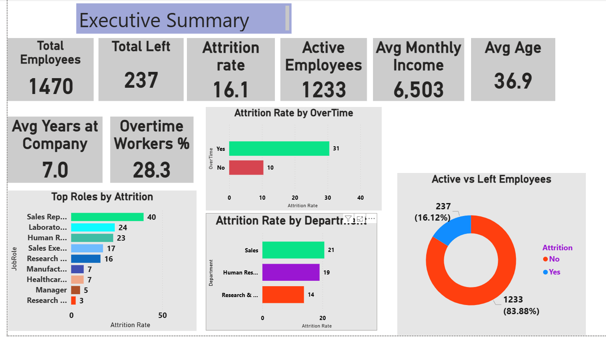
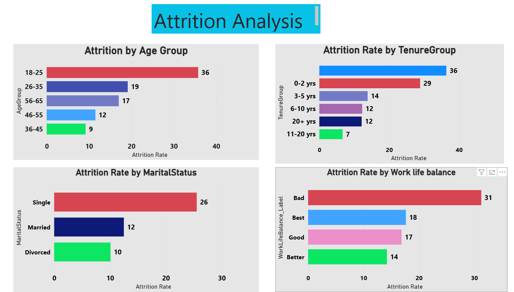
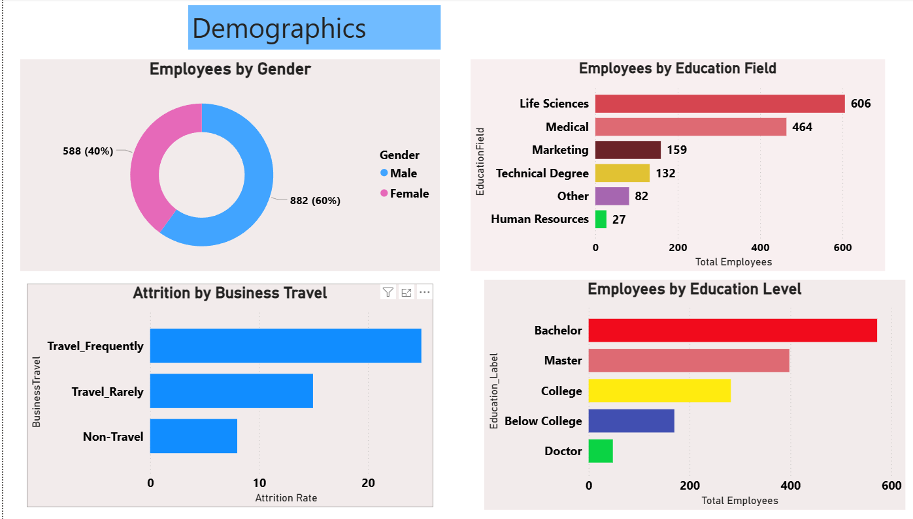
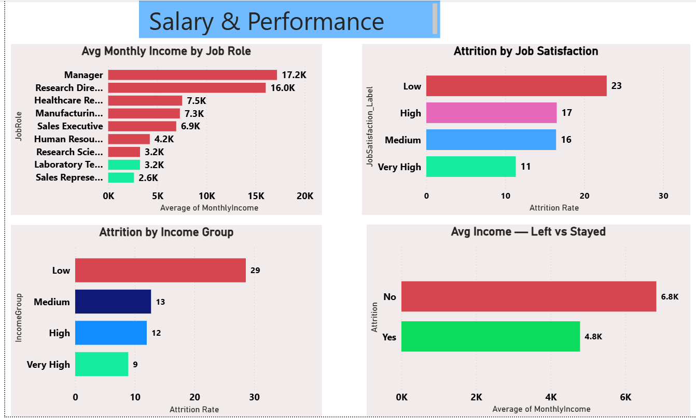

# 👥 IBM HR Attrition Analysis


---

## 📌 Project Overview

This project performs a complete end-to-end HR Attrition Analysis on the 
**IBM HR Analytics Employee Attrition Dataset**.

The goal is to identify key factors driving employee attrition and extract 
actionable insights to help HR teams improve retention strategies using 
Python, SQL, and Power BI.

---

## 🗂️ Dataset

| Detail | Info |
|---|---|
| Source | IBM HR Analytics — Kaggle |
| Total Employees | 1,470 |
| Total Features | 35 columns |
| Target Variable | Attrition (Yes/No) |
| Attrition Rate | 16.1% |

**Source:** [Kaggle — IBM HR Analytics](https://www.kaggle.com/datasets/pavansubhasht/ibm-hr-analytics-attrition-dataset)

---

## 🛠️ Tools Used

- **Python (Pandas)** — Data cleaning and feature engineering
- **SQLite** — SQL analysis and querying
- **Power BI** — Dashboard visualization
- **DB Browser for SQLite** — Query execution
- **Google Colab** — Python environment

---
---

## 🐍 Python Cleaning Steps

1. Loaded raw dataset — 1,470 rows × 35 columns
2. Removed 3 useless columns — `EmployeeCount`, `Over18`, `StandardHours`
3. Created `Attrition_Flag` — converted Yes/No to 1/0
4. Created label columns — Education, JobSatisfaction, WorkLifeBalance etc.
5. Created `AgeGroup` — 18-25, 26-35, 36-45, 46-55, 56-65
6. Created `IncomeGroup` — Low, Medium, High, Very High
7. Created `TenureGroup` — 0-2 yrs, 3-5 yrs, 6-10 yrs etc.
8. Saved as `HR_Attrition_Cleaned.csv`

**Final shape: 1,470 rows × 42 columns**

---

## 🔍 SQL Analysis — 12 Queries

### ✅ Q1 — Overall Attrition KPI
```sql
SELECT COUNT(*) AS total_employees,
       SUM(Attrition_Flag) AS total_left,
       COUNT(*) - SUM(Attrition_Flag) AS total_stayed,
       ROUND(SUM(Attrition_Flag) * 100.0 / COUNT(*), 1) AS attrition_rate
FROM HR_Attrition_Cleaned;
```
**Result:** 1,470 employees | 237 left | 16.1% attrition rate

### ✅ Q2 — Attrition by Department
Sales — 20.6% | HR — 19.0% | R&D — 13.8%

### ✅ Q3 — Attrition by Job Role
Sales Rep — 39.8% | Lab Technician — 23.9% | Research Director — 2.5%

### ✅ Q4 — Attrition by Age Group
18-25 — 35.8% | 26-35 — 19.1% | 36-45 — 9.2%

### ✅ Q5 — Overtime Impact
Overtime Yes — 30.5% | Overtime No — 10.4% — **3x more likely to leave!**

### ✅ Q6 — Attrition by Marital Status
Single — 25.5% | Married — 12.5% | Divorced — 10.1%

### ✅ Q7 — Income Gap (Left vs Stayed)
Stayed — $6,833 avg | Left — $4,787 avg | **$2,046 gap!**

### ✅ Q8 — Attrition by Work Life Balance
Bad — 31.3% | Better — 14.2%

### ✅ Q9 — Attrition by Job Satisfaction
Low — 22.8% | Very High — 11.3%

### ✅ Q10 — Income by Job Role
Manager — $17,182 | Sales Rep — $2,626

### ✅ Q11 — Attrition by Tenure
0-2 yrs — 28.9% | 11-20 yrs — 6.7%

### ✅ Q12 — Master Summary by Department
Sales highest attrition AND highest income — money alone doesn't retain!

---

## 📊 Power BI Dashboard

### 🏠 Page 1 — Executive Summary


### 📉 Page 2 — Attrition Analysis


### 👥 Page 3 — Demographics


### 💰 Page 4 — Salary & Performance


---

## 💡 Key Findings

| # | Finding | Insight |
|---|---|---|
| 1 | Overall Attrition | 16.1% — 237 out of 1,470 employees left |
| 2 | Highest Risk Role | Sales Rep — 39.8% attrition rate |
| 3 | Overtime Impact | Overtime workers leave 3x more than non-overtime |
| 4 | Age Factor | Young employees (18-25) have 35.8% attrition |
| 5 | Income Gap | Employees who left earned $2,046 less per month |
| 6 | Tenure Risk | New employees (0-2 yrs) have 28.9% attrition |
| 7 | Satisfaction | Low satisfaction = 2x more likely to leave |
| 8 | Marital Status | Single employees leave at 2.5x rate of divorced |

---

## 🚀 Business Recommendations

1. **Reduce overtime** — Overtime workers leave 3x more — biggest risk factor!
2. **Increase Sales Rep salaries** — Lowest paid ($2,626) and highest attrition (39.8%)
3. **Improve onboarding** — 28.9% of new employees leave within 2 years
4. **Focus on young employees** — 18-25 age group has 35.8% attrition
5. **Improve job satisfaction** — Low satisfaction doubles attrition risk
6. **Review Sales department** — 20.6% attrition despite highest avg income

---

## 📁 Repository Structure

IBM-HR-Attrition-Analysis/
│
├── README.md
│
├── queries/
│   ├── 01_overall_kpi.sql
│   ├── 02_department_analysis.sql
│   ├── 03_jobrole_analysis.sql
│   ├── 04_age_analysis.sql
│   ├── 05_overtime_analysis.sql
│   └── 06_salary_analysis.sql
│
├── datasets/
│   └── README.md
│
└── images/
├── Executive_Summary.png
├── Attrition_Analysis.png
├── Demographics.png
└── Salary_Performance.png

---

## 🧠 SQL Concepts Covered

| Concept | Used In |
|---|---|
| SELECT, WHERE, ORDER BY | All queries |
| GROUP BY + Aggregations | All queries |
| SUM, COUNT, AVG, ROUND | All queries |
| CASE WHEN | Data cleaning in SQL |
| HAVING | Filtered group queries |
| Subquery | Complex calculations |
| ALTER TABLE | Adding new columns |
| UPDATE | Filling new columns |

---

## 👤 Author
- **Name:** Tekcham Chingkheinganba Meitei
- 📧 tekchamchingkhei@gmail.com
- 💼www.linkedin.com/in/tekchamchingkheinganbameitei
- 🎓 NIT Manipur — Mechanical Engineering
- 💼 Ex-Genpact — Trust & Safety Analyst

---

⭐ If you found this project helpful, please give it a star!

## 🔄 Project Workflow
